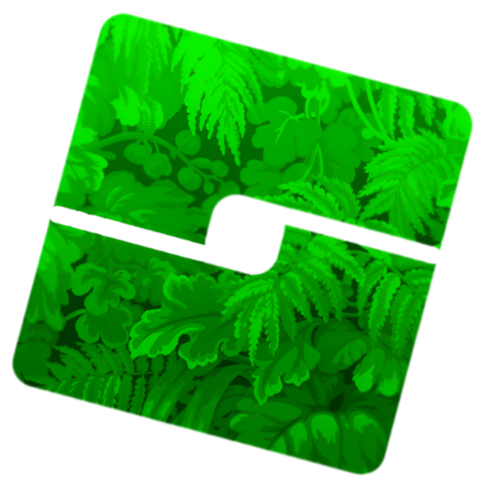

<h1 align="center">Leafstrap</h1>

  A customizable, cross-platform Roblox bootstrapper for Windows and macOS.

  

Leafstrap gives you more control over how Roblox launches and behaves, with launcher customization, mods, FastFlag profiles, deployment controls, account tools, region selection, and Discord Rich Presence in one app.

## macOS support

This branch targets **macOS 14 Sonoma or newer** and produces separate installers for:

- Apple Silicon (`Leafstrap-macos-arm64.pkg`) — M1, M2, M3, M4, and newer Apple chips
- Intel (`Leafstrap-macos-x64.pkg`) — Intel-based Macs

Download the package matching **Apple menu → About This Mac → Chip/Processor**.

> [!NOTE]
> Packages built without Apple Developer credentials are unsigned. For private testing, right-click the package and choose **Open**. A public release should be Developer ID signed and notarized so Gatekeeper can verify it normally.

## Building the macOS packages

The included GitHub Actions workflow is the recommended build path because creating a `.pkg` requires Xcode and Apple's packaging tools.

1. Push this repository to GitHub with its submodules.
2. Open **Actions → Build Leafstrap for macOS → Run workflow**.
3. Download both packages from the completed workflow's **Artifacts** section.

Creating a tag such as `v1.0.3-macos.1` also creates a draft GitHub release containing both packages. If all Apple signing secrets documented in [MACOS-BUILD.md](./MACOS-BUILD.md) are configured, tagged builds are signed and notarized automatically.

## Highlights

- Customizable bootstrapper with Leafstrap Classic as the default
- Roblox Player and Studio launch/deployment controls
- Mods, FastFlag profiles, and region selection
- Account manager and Quick Play tools
- Leafstrap and Roblox Studio Discord Rich Presence
- Native macOS URI and Roblox place/model file handling

## Credits and licensing

Leafstrap's cross-platform foundation is based on [Froststrap](https://github.com/Froststrap/Froststrap), which is derived from [Fishstrap](https://github.com/fishstrap/fishstrap) and [Bloxstrap](https://github.com/bloxstraplabs/bloxstrap). Their contributors made the macOS backend and much of the feature set possible.

Leafstrap remains licensed under the [Mozilla Public License 2.0](./LICENSE). Source notices and upstream attribution are intentionally preserved.
